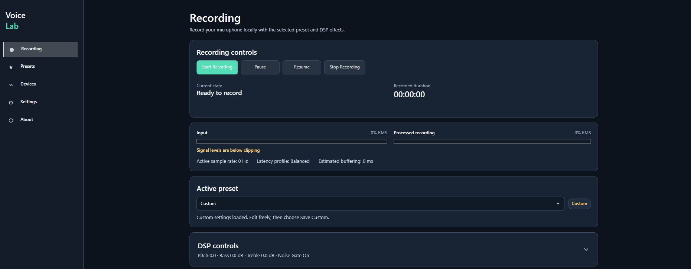

# VoiceLab


<p align="center">
  
</p>

Local • Offline • Windows • No Telemetry • No AI

VoiceLab is a Windows desktop application for applying real-time DSP voice effects and recording processed microphone audio.

It is built with .NET 8, WPF, and NAudio, and runs entirely on your computer. VoiceLab does not require an account, internet connection, cloud services, telemetry, or AI models.

---

## Features

- 🎙️ Real-time DSP voice processing
- 💾 Processed WAV recording
- 🎛️ Built-in and custom presets
- 🎧 Live Preview
- 🎚️ Adjustable pitch, tone, reverb, echo, robot, and gain
- 🌍 English and Turkish interface
- 🔒 Fully offline operation
- ⚡ Lightweight and low-latency

---

## Download

This repository distributes source code only. Pre-built binaries, installers,
and release packages are not provided.

You can build VoiceLab locally by following the instructions below.

---

## Build from Source

### Requirements

- Windows 10 or Windows 11 (x64)
- .NET 8 SDK
- Visual Studio 2022 or Visual Studio Code

### Build

```bash
dotnet restore
dotnet build -c Release
```

### Run

```bash
.\VoiceLab.App\bin\Release\net8.0-windows\VoiceLab.exe
```

The Release build produces `VoiceLab.exe`, a Windows GUI application that does
not allocate a console. For development, `dotnet run --project
.\VoiceLab.App\VoiceLab.App.csproj` remains available from a terminal.

---

## Privacy

VoiceLab runs completely offline.

It does **not**:

- collect analytics
- send telemetry
- upload recordings
- communicate with cloud services
- use AI models
- require an account

All recordings, presets, and settings remain on your local computer.

For upgrade compatibility, renamed builds continue to use the existing
`LocalVoiceChanger` AppData directories. Existing settings, presets, recordings,
and logs therefore load in place without copying or deleting user data.

- Settings: `%LOCALAPPDATA%\LocalVoiceChanger\settings.json`
- Recordings: `%LOCALAPPDATA%\LocalVoiceChanger\Recordings`
- Logs: `%LOCALAPPDATA%\LocalVoiceChanger\logs`
- Presets: `%APPDATA%\LocalVoiceChanger\presets.json`

---

## Project Structure

- **VoiceLab.App** – WPF user interface
- **VoiceLab.Audio** – audio engine and recording
- **VoiceLab.Effects** – DSP effects
- **VoiceLab.Infrastructure** – settings and persistence
- **VoiceLab.Tests** – automated tests

---

## License

VoiceLab is released under the MIT License.

See the `LICENSE` file for more information.
